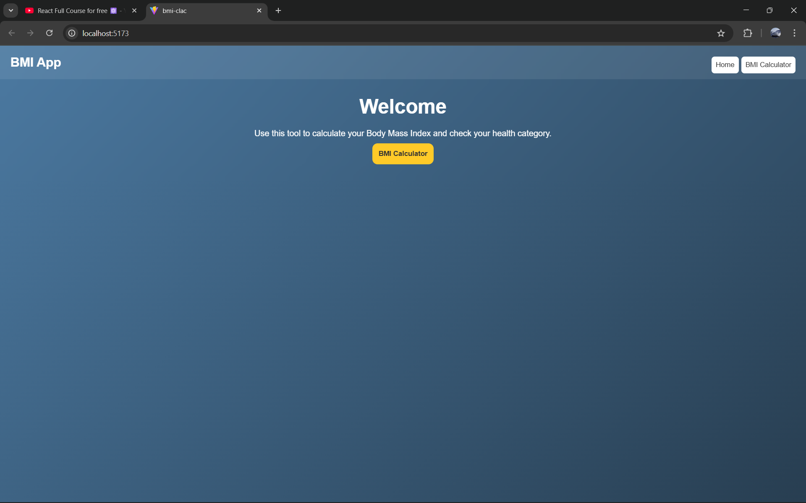
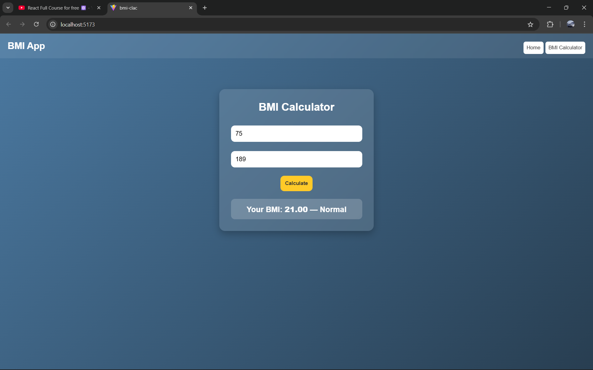

# Ex06 BMI Calculator
## Date: 03-12-2025

## AIM
To develop a responsive and interactive Body Mass Index (BMI) Calculator using React that allows users to input their height and weight, and calculates their BMI to categorize their health status (e.g., Underweight, Normal, Overweight, Obese).

## DESIGN STEPS

### STEP 1: Initialize React Project

Create a new React app using vite
    1. npm create vite@latest
    2. cd "Project-Name"
    3. npm run dev ( to run the development server)

### STEP 2: Set Up Routing

Create routing structure with react-router-dom:
    1. Home route (/) – Intro or Navigation
    2. BMI Calculator route (/bmi)
    3. Result route (/result)

### STEP 3: Design the BMI Form Page

<li>Create a form to accept Height (in cm or m) and Weight (in kg).</li>

<li>On form submit, navigate to the result page with entered values via URL query params or context/state.</li>

## STEP 4: Handle Input Validation

<li>Check if height and weight are valid numbers.</li>

<li>Optionally, show error messages for invalid inputs.</li>

### STEP 5: Perform BMI Calculation

<li>In the result component:

<li>Extract height and weight from the route (URL or passed state).</li>

<li>Apply the BMI formula:</li>


​
 
<li>Convert height from cm to m if needed.</li></li>

### STEP 6: Display Result

<li>Show calculated BMI.</li>

<li>Show category based on BMI range:

<li>Underweight, Normal, Overweight, Obese, etc.</li></li>

### STEP 7: Navigation Options

<li>Provide a button to go back to the BMI form to calculate again.</li>

### STEP 8: Enhancements

<li>Add styling using CSS or Tailwind.</li>

## PROGRAM

### Navbar.jsx
```jsx
export default function Navbar({ setPage }) {
  return (
    <nav className="navbar">
      <h2>BMI App</h2>
      <div className="nav-links">
        <button onClick={() => setPage("home")}>Home</button>
        <button onClick={() => setPage("bmi")}>BMI Calculator</button>
      </div>
    </nav>
  );
}
```

### Home.jsx
```jsx
export default function Home({ setPage }) {
    return (
        <div className="center">
        <h1>Welcome</h1>
        <p>
            Use this tool to calculate your Body Mass Index and check your health category.
        </p>
        <button onClick={() => setPage("bmi")}>BMI Calculator</button>
        </div>
    );
}
```

### BmiCalculator.jsx
```jsx
import { useState } from "react";

export default function BmiCalculator() {
  const [weight, setWeight] = useState("");
  const [height, setHeight] = useState("");
  const [result, setResult] = useState(null);

  const calculateBMI = () => {
    if (!weight || !height) return;

    const heightMeters = height / 100;
    const bmi = (weight / (heightMeters * heightMeters)).toFixed(2);

    let status = "";
    if (bmi < 18.5) status = "Underweight";
    else if (bmi < 24.9) status = "Normal";
    else if (bmi < 29.9) status = "Overweight";
    else status = "Obese";

    setResult({ bmi, status });
  };

  return (
    <div className="container">
      <h1>BMI Calculator</h1>

      <input
        type="number"
        placeholder="Enter weight (kg)"
        value={weight}
        onChange={(e) => setWeight(e.target.value)}
      />

      <input
        type="number"
        placeholder="Enter height (cm)"
        value={height}
        onChange={(e) => setHeight(e.target.value)}
      />

      <button onClick={calculateBMI}>Calculate</button>

      {result && (
        <p className="result">
          Your BMI: <strong>{result.bmi}</strong> — {result.status}
        </p>
      )}
    </div>
  );
}
```
### App.jsx
```jsx
import { useState } from "react"
import Navbar from "./navbar"
import Home from "./Home"
import BmiCalculator from "./BmiCalculator"

function App() {
  const [page, setPage] = useState("home");

  return (
    <div>
      <Navbar setPage={setPage} />

      {page === "home" && <Home setPage={setPage} />}
      {page === "bmi" && <BmiCalculator />}
    </div>
  );
}

export default App
```

### styles.css
```css
/* Global styling */
* {
  margin: 0;
  padding: 0;
  box-sizing: border-box;
}

body {
  font-family: "Poppins", sans-serif;
  background: linear-gradient(135deg, #4b79a1, #283e51);
  color: #fff;
  min-height: 100vh;
}

/* Navbar */
.navbar {
  display: flex;
  justify-content: space-between;
  align-items: center;
  padding: 15px 20px;
  height: 4rem;
  background: rgba(255, 255, 255, 0.08);
  backdrop-filter: blur(10px);
}

.nav-links button {
  background: #fff;
  border: none;
  width: fit-content;
  padding: 8px;
  cursor: pointer;
  border-radius: 6px;
  transition: 0.2s ease-in-out;
  font-weight: 500;
  margin-left: 5px;
  font-family:Arial, sans-serif;
}

.nav-links button:hover {
  transform: scale(1.05);
  background: #ffe082;
}

.center {
    backdrop-filter: blur(10px);
    padding: 30px;
    text-align: center;
    justify-content: center;
    align-items: center;
}
.center  h1 {
  margin-bottom: 20px;
  font-size: 38px;
  font-weight: 600;
}

/* Content container */
.container {
  max-width: 400px;
  margin: 80px auto;
  background: rgba(255, 255, 255, 0.12);
  backdrop-filter: blur(10px);
  padding: 30px;
  border-radius: 15px;
  text-align: center;
  box-shadow: 0 8px 20px rgba(0, 0, 0, 0.25);
}

.container h1 {
  margin-bottom: 20px;
  font-size: 28px;
  font-weight: 600;
}

/* Inputs */
input {
  width: 100%;
  padding: 12px;
  margin: 12px 0;
  border-radius: 10px;
  border: none;
  outline: none;
  font-size: 16px;
}

/* Button */
button {
  padding: 12px;
  background: #ffca28;
  color: #333;
  border: none;
  border-radius: 10px;
  cursor: pointer;
  font-weight: 600;
  transition: 0.25s;
  margin-top: 10px;
}

button:hover {
  background: #ffb300;
  transform: translateY(-3px);
}

/* Result box */
.result {
  margin-top: 20px;
  font-size: 20px;
  background: rgba(255, 255, 255, 0.18);
  padding: 12px;
  border-radius: 10px;
  font-weight: bold;
}
```

## OUTPUT





## RESULT

The BMI Calculator successfully takes user input for height and weight, performs the BMI calculation in real-time using React state and event handling, and displays the BMI value along with the corresponding health category.
